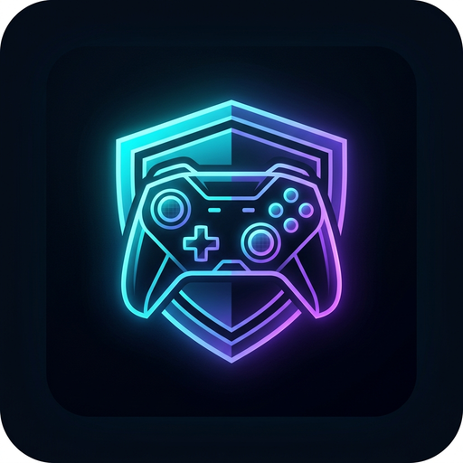

<div align="center">

  

  # 🎮 GameVault

  **The Ultimate Lightweight Desktop Command Center & Alt-Account Manager for Gamers.**

  [](https://github.com/ArtoMoon/GameVault/releases/latest)
  [](https://tauri.app/)
  [](https://www.rust-lang.org/)
  [](https://nextjs.org/)
  [](https://www.typescriptlang.org/)
  [](https://www.mongodb.com/)
  [](https://tailwindcss.com/)

  <p align="center">
    Track, organize, and manage your alternate gaming accounts with live API stats, authentic character portraits, and dynamic platform presets across <b>Albion Online</b>, <b>Riot Games</b> (LoL, Valorant, TFT), <b>Steam</b>, <b>Epic Games</b>, and custom gaming platforms.
  </p>

  <p align="center">
    <a href="https://github.com/ArtoMoon/GameVault/releases/latest"><b>📥 Download GameVault Setup (.exe)</b></a> •
    <a href="#-key-features">Key Features</a> •
    <a href="#-why-tauri-v2">Why Tauri?</a> •
    <a href="#-getting-started">Development</a>
  </p>

</div>

---

## ⚡ Why GameVault? (Tauri v2 Architecture)

GameVault was completely re-architected from heavy Electron down to a modern, ultra-optimized **Tauri v2 + Rust** desktop engine:

| Benchmark | Traditional Clients (Electron) | 🎮 **GameVault (Tauri v2)** |
|---|---|---|
| **Setup File Size** | ⚠️ ~185 MB | ⚡ **~28 MB (85% smaller!)** |
| **Installation Speed** | ⏳ 1-2 minutes | 🚀 **Under 3 seconds** |
| **Idle Memory (RAM)** | ❌ 200 MB – 350 MB | 🛡️ **~40 MB – 60 MB** |
| **Gaming Performance** | Can cause micro-stutters / FPS drops | **Zero impact on in-game FPS** |
| **Desktop Tech** | Chromium + Node bundled | **Native Windows WebView2 + Rust Core** |

---

## 🌟 Key Features

### 🛡️ 1. Albion Online Live API Synchronization
* **API Key-Free Lookup:** Instant character verification directly via Albion Online's official public gameinfo & killboard infrastructure.
* **Live Combat & Fame Metrics:** Automatically synchronizes **Total Lifetime Fame**, **PvP Kill Fame**, **PvE Fame**, **Guild**, and **Alliance** data.
* **Smart Tier & Level Estimation:** Automatically calculates character level progression and Tier badges (Tier 3 to Tier 8) based on total lifetime fame.
* **Authentic In-Game Avatars:** Renders authentic square character portrait assets (`AVATAR_07`, etc.) directly from game data.
* **Global Server Coverage:** Europe (AMS), Americas (US), Asia (SGP), and Global endpoints supported.

### 🔴 2. Riot Games & League of Legends Live Tracking
* **Riot ID Integration:** Synchronize summoners using modern `GameName#TAG`.
* **Live Competitive Metrics:** Solo/Duo & Flex ranks, LP, win rates, and match statistics.
* **Multi-Region Support:** TR, EUW, EUNE, NA, KR, and all official Riot server clusters.
* **Rate-Limit Safe:** Automatic 1500ms safety throttling with automatic HTTP 429 backoff handling.

### 🎛️ 3. Universal Platform & Game Presets
* **Pre-Built Platform Presets:** Instant 1-click templates for **Albion Online**, **Riot Games**, **Steam**, **Epic Games**, **Battle.net**, **EA app**, and **Ubisoft Connect**.
* **Dynamic Custom Ordering:** Move platforms up and down to customize your personal layout.
* **Full Platform Customization:** Customize platform names, emoji icons, accent colors, descriptions, and underlying API engine types.
* **Restore Defaults:** Reset to default system platforms with a single click.

### ✏️ 4. Universal Platform-Aware Account Manager
* **Unified Edit Modal:** Change account credentials, login usernames, platform/server, game, level, tier/rank, account status, category, and private notes.
* **Flexible View Modes:** Switch between **Grid Cards**, **Compact Cards**, and high-density **Table List** views.
* **Status Badging:** Quick visual indicators for Available, Active, In-Use, Leveling, Archived, and Error states.
* **Custom Categories:** Organize accounts with custom colored chips (*Main*, *Smurf*, *For Sale*, *Ranked*, etc.).

### 🌐 5. Native Desktop Polish & Internationalization
* **Dark Cyberpunk UI:** Built with custom Tailwind CSS v4, sleek radial gradients, and glowing accents.
* **i18n Dual-Language Support:** Instant 1-click toggle between English (🇬🇧) and Turkish (🇹🇷).
* **System Tray & Clean Teardown:** Smooth desktop lifecycle with automatic background process management.

---

## 📥 Download Windows Installer (.exe)

Get the latest ultra-fast **GameVault Windows Setup** directly from GitHub Releases:

👉 **[Download GameVault v0.3.1 Windows Setup (.exe)](https://github.com/ArtoMoon/GameVault/releases/latest)** (~28 MB)

*(Includes automatic desktop shortcut and Windows uninstaller).*

---

## 🚀 Getting Started (Development)

### Prerequisites
* [Node.js](https://nodejs.org/) (v20 or higher)
* [Yarn](https://yarnpkg.com/)
* [Rust & Cargo](https://rustup.rs/) (MSVC toolchain: `rustup default stable-x86_64-pc-windows-msvc`)
* [Visual Studio C++ Build Tools](https://visualstudio.microsoft.com/visual-cpp-build-tools/) (`Desktop development with C++`)
* Local [MongoDB Community Server](https://www.mongodb.com/try/download/community) or MongoDB Atlas URI

### 1. Clone the Repository
```bash
git clone https://github.com/ArtoMoon/GameVault.git
cd GameVault
```

### 2. Install Dependencies
```bash
yarn install
```

### 3. Database Configuration
Create a `.env.local` file in the root directory:
```env
MONGODB_URI=mongodb://localhost:27017/gamevault
```

### 4. Run Desktop Development Mode (Tauri)
```bash
yarn tauri:dev
```
*(Runs Next.js hot-reloading dev server and launches the native Tauri desktop window simultaneously).*

### 5. Build Lightweight Windows Setup (.exe)
```bash
yarn tauri:build
```
The optimized NSIS setup installer (~28 MB) will be generated at:
```text
src-tauri/target/release/bundle/nsis/GameVault_0.3.1_x64-setup.exe
```

---

## 📁 Repository Structure

```text
├── app/
│   ├── accounts/[id]/          # Detailed account analytics & match history
│   ├── actions/                # Next.js Server Actions (accounts, platforms, sync)
│   ├── api/                    # API Route Handlers (/api/sync-accounts, /api/accounts)
│   ├── platform/
│   │   ├── [platform]/         # Level 1: Platform & Games Showcase Portal
│   │   │   └── [game]/         # Level 2: Dedicated Game Accounts Dashboard
│   ├── layout.tsx              # Root HTML layout, font setup, and providers
│   └── page.tsx                # Landing Dashboard with account stats
├── components/                 # Reusable UI Components
│   ├── PlatformOverview.tsx    # Platform & games catalog view
│   ├── PlatformManagerModal.tsx# Platform presets, custom ordering & editor
│   ├── EditAccountModal.tsx    # Universal account editor modal
│   ├── AddAccountForm.tsx      # Multi-platform account creator form
│   └── Navbar.tsx              # Titlebar with GameVault brand & language switcher
├── frontend-dist/              # Ultra-fast splash / loader for Tauri production boot
├── lib/
│   ├── platformPresets.ts      # Built-in presets (Albion, Riot, Steam, Epic, etc.)
│   ├── db/                     # Cached Mongoose connection
│   ├── i18n/                   # Language Context & Dictionary (TR / EN)
│   └── riot/                   # Riot Games API client
├── models/                     # MongoDB Schemas (Account, Platform, Category)
├── scripts/
│   ├── prepare-standalone.cjs  # Next.js standalone dereferencing & bundling
│   ├── prepare-tauri.cjs       # Node.js runtime preparation for Tauri sidecar
│   ├── generate-icons.cjs      # Multi-resolution ICO & PNG generator
│   └── publish-release.mjs     # Automated GitHub Release uploader
├── src-tauri/                  # Tauri v2 native Rust backend & NSIS configuration
│   ├── icons/                  # High-tech glowing neon GameVault icon set
│   ├── src/lib.rs              # Rust process lifecycle & TCP stream watcher
│   └── tauri.conf.json         # Tauri v2 bundle & window configuration
└── package.json
```

---

## ⚖️ Legal Disclaimer

*GameVault is an independent third-party tool and is not affiliated with, endorsed by, or sponsored by Riot Games, Sandbox Interactive (Albion Online), Valve (Steam), Epic Games, Blizzard Entertainment, or any other game publisher. All trademarks and registered trademarks belong to their respective owners.*

---

## 📝 License

This project is licensed under the [MIT License](LICENSE).
